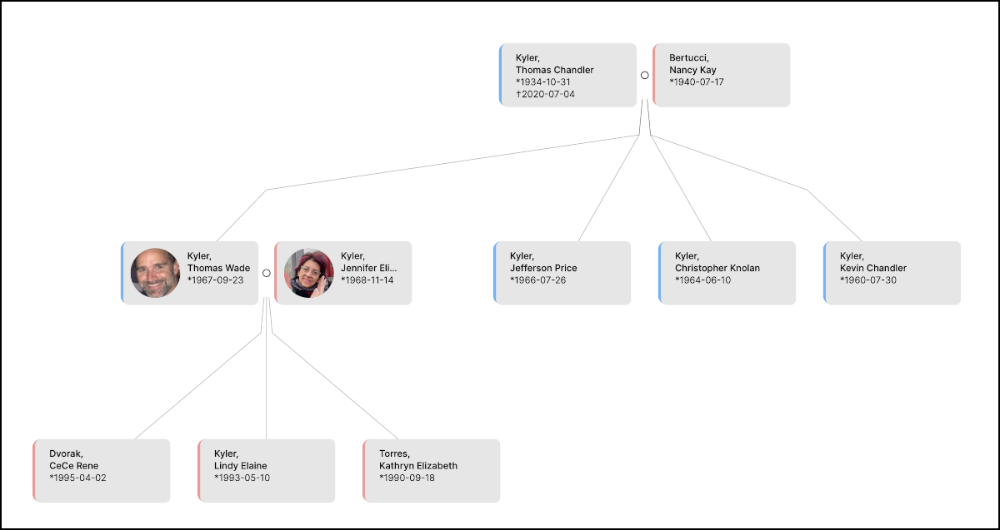

#  Common Workflows

---

This section is specifically written for new users who have no idea what terms like ***Python***,  ***Github***, ***open-source***, or ***relational-database*** mean.  Here, we fully assume that someone in your family is the ***Master Nerd*** of your Family Tree Database and have convinced you to login to Gramps Web and help contribute.  This section discusses some common workflows you may encounter with Gramps Web and hopefully, by reading through this section, you will know where to jump in with confidence and do your part. As you read on, it may seem like we are getting sidetracked, but we assure you it will all come together before the end.

##	Gramps Desktop

In the beginning, long before Gramps Web here, there was (and still is) ***Gramps Desktop***.  Gramps Desktop is a quite powerful software program for building a genealogy database, but Gramps Desktop is not a ***Web-app*** you run in your web browser. This means it does not connect to the internet, nor does it share information with other copies of ***Gramps Desktop*** running on other folks computers.  Like Microsoft Word or Excel of olden times, what it does, is save its data as a file on your own computer.   You can, of course, send the database file to others such that they can open in with their own copy of Gramps Desktop, but you cannot work on the same file at the same time.  Enter Gramps Web!

##	Gramps Web

Gramps Web was made possible because of the internet and was borne out of the desire to involve others in building a genealogy database and make it easier for multiple family members to contribute.  Everybody knows that Grandma and Grand-Papa have all the old family photos, all the old family stories and all the old birth certificates, but the problem is Grandma lives 2000km away with Uncle Guiseppe and the family's genealogical hoard is stuffed in a box under Grandma's bed.  If only Guiseppe could get that info to the ***Nerdy Nephew*** without leaving his home or enduring a multi-day visit from the bothersome young man.  As it turns out, Gramps Web can help Uncle Guiseppe to do just that!

##	The Family Tree database

As we said previously, this section of the User Guide assumes some ***Family Nerd*** exists and is interested in growing the family tree database.  A first question worthy of asking is,  "how much of the family Tree is already recorded in Gramps Web?"  When you login for the first time, will you see yourself in the Family Tree? ..Your spouse? ...your children if you have them?   How about any siblings? .. or inlaws?  Are their birthdays correct? .....any photos? etc. Just how ***MUCH*** work has that Nerdy Nephew done?, and what exactly can you do to help out?  Let's walk through a common scenario of building a Family Tree with Gramps Desktop and Gramps Web to see how things work together.

##	How it Begins (typically)

We assume that everybody agrees that using a Software Program is the way to go to store your genealogical Family Tree information.  We further assume that The Gramps Web is the chosen solutions for this.  The work typically begins with someone compiling the most basic of Family Tree information:  Names of Persons, who is married to whom, and whom is a child of whom.  These three basic connections are enough to connect everyone together in the most basic Family Tree as shown below.  

With knowledge of Names, marriages and children in hand, ***Person Records*** are created first, one Record for each Person.  Afterwords,