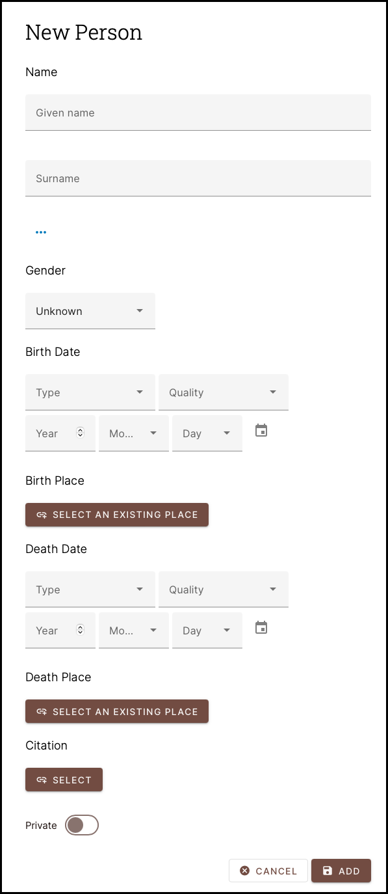
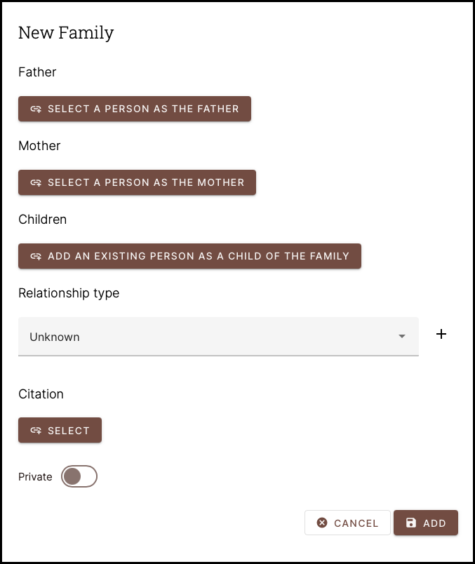
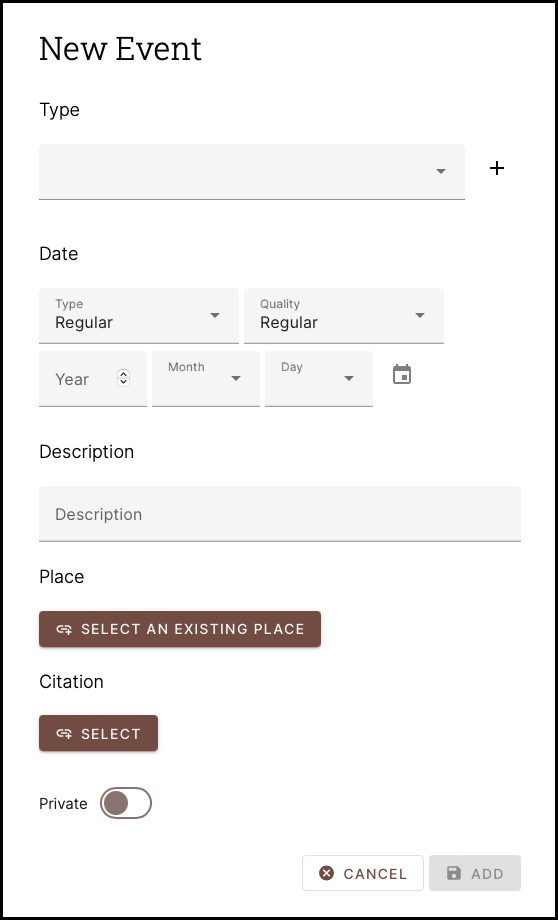
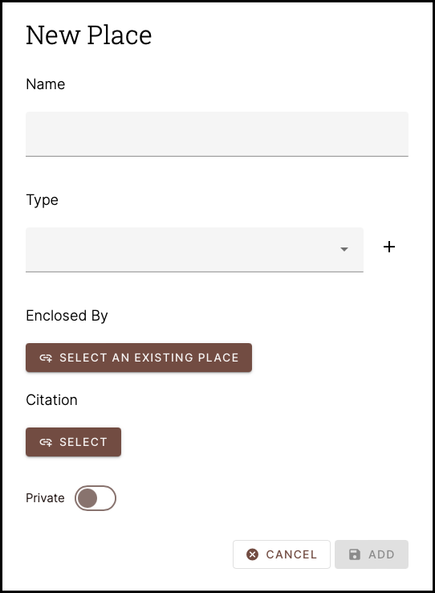
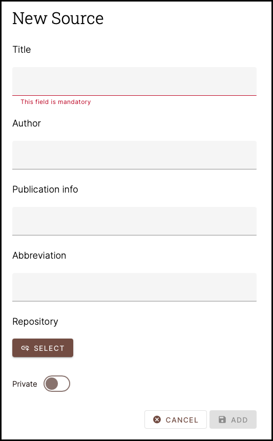
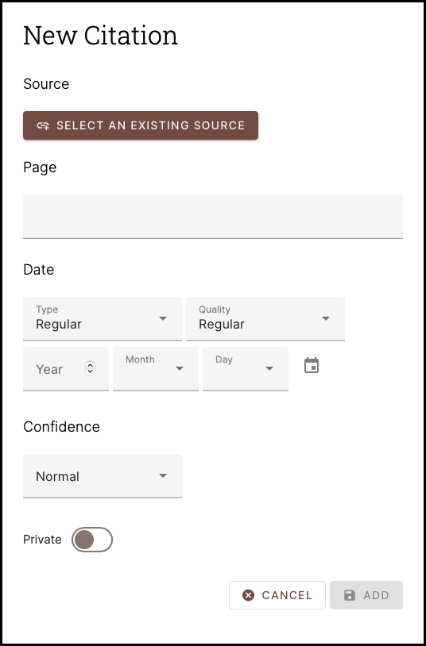
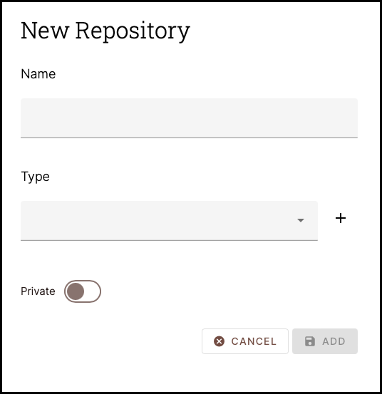
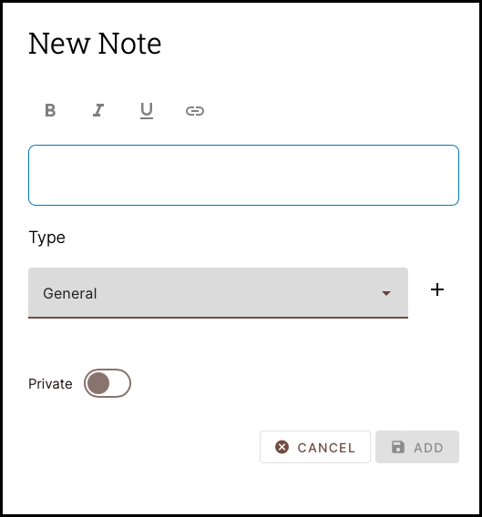
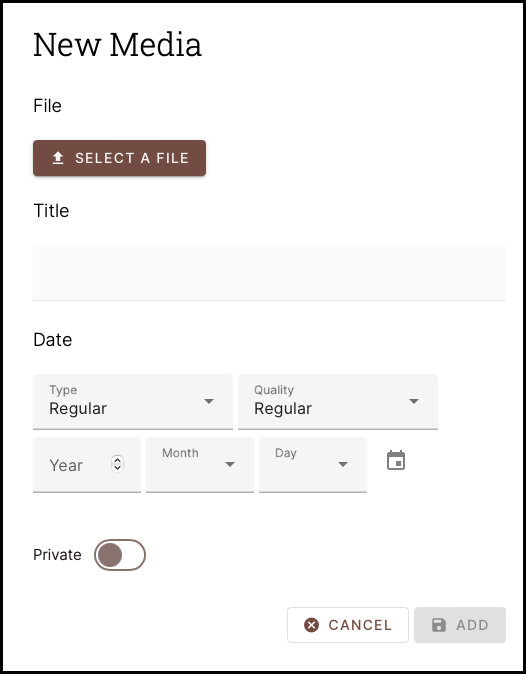
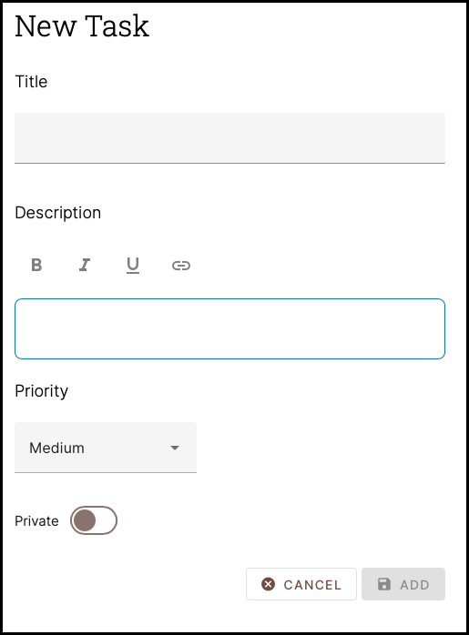

---

Gramps Web have 10 ***Primary*** Record Types, each described below:

!!!Note
	The following screenshots show what we call ***Initial Add Forms***.  The ***Initial Add Form*** is the Page you see while in the process of creating a new Record, i.e. "*filling out the form*".  The Record will **not** be saved until you click the [**ADD**] Button at the bottom of these forms.  If you navigate away from this Page, then the Record will not be saved.  This is the same as hitting the [**CANCEL**] button.  Hitting the [***ADD***] button will save the Record and immediately take you to that Record's ***[<u>Record View</u>](../record_view/record_view.md)*** page.
	
	* Note that it is very common to partially fill out the *initial add form*, save the Record, and then edit it afterwards.
	
###	Person Records

{ align=left width=150 }

The ***Person*** Record is used to store basic information about a Person. The minimum amount of information you should provide is the minimum information for ***YOU*** to know who the Record represents. It could the first name only. You can always edit/add information to the Record later.  Indeed its quite common for users to provide the Given Name and Surname only, create/add the Record and then go back and edit it later.

---

###	Family Records

{ align=left width=150 }

The ***Family*** Record is used to store information about a Family.  While it is possible to create a Family Record with only one person in it, this does not make logical sense.  The distinguishing characteristic of the Family Record is the addition of more than one Person to the Record and their relationship to one another.  The basic Family Record fields specify a Father / Mother / Children

---

###	Event Records

{ align=left width=150 }

The ***Event*** Record is used to record significant events in Persons/Families lives. The most common Event Record types are for Births, Deaths and Marriages, but many others exist such as Bar Mitzvah's, Burials, Graduations, Naturalizations, Divorces, etc.  An Event Record is independent of any Person/Family unless it is ***associated*** with them. Some of these associations are applied implicitly and others are not.  For example, when you are adding a new Person and enter their Birthdate, then Gramps Web creates the ***Birth Event*** record at the same time it creates the Person Record and associates the two for you.  This is for convenience.  It is perfectly possible to create a Birthdate Event Record associated with no-one and associate it to a specific Person Record later.
 

---

###	Place Records

{ align=left width=150 }

The ***Place*** record is used to record significant places.  These are commonly civil entities such as States, Cities, Towns but could also be buildings, Parks or Lakes for that matter.  Place Records are typically attached to Event Records and are commonly created after the Event they are associated with.

Place Records have optional fields for Latitude and Longitude coordinates, and when present, the Places may be viewed on Gramps Web Map.  Note that in geneaology, places are NOT used to record addresses. See [Residence Addresses](../examples/examples.md) in the Examples section.

---

###	Source Records

{ align=left width=150 }

The ***Source*** Record Type is used to record Sources of Information and are important to establishing the accuracy of a relation.  While its easy to do a Google Search and think of the results as "the source of your information", that is not really a source, but perhaps only a reference to some other source.  Typical sources of recorded information are Birth Certificates, Death Certificates, Census Data, Ship Manifests; however, a source could also be a Person who has given first-hand testimony as a witness to some event.  We discuss sources more in [How Tos - Sources & Citations](../../../how_tos/sources_citations/)

---

###	Citation Records

{ align=left width=150 }

The ***Citation*** Record is used to record a citation of a Source.  ***Sources*** of information in the genealogical sense can be quite large, for example, "the 1940 Census" is a Source, as is "The New York Times".  That is a lot of information!  A citation record focuses the scope of the source so specific data may be located.  A citation may be something like a Newspaper Date and Page Number, or a magazine title, issue, author and page number, etc.  Citation Records are associated with Source Records.

---

###	Repository Records

{ align=left width=150 }

A ***Repository*** record is used to capture a where information is actually located.  Typical repositories are Libraries, Archives,  A box under your Mom's Bed, etc.

---

###	Note Records

{ align=left width=150 }

---

###	Media Object Records

{ align=left width=150 }

---	

###	Task Records

{ align=left width=150 }

---

##	Record View

<!-- whitespace for navigation purposes -->

