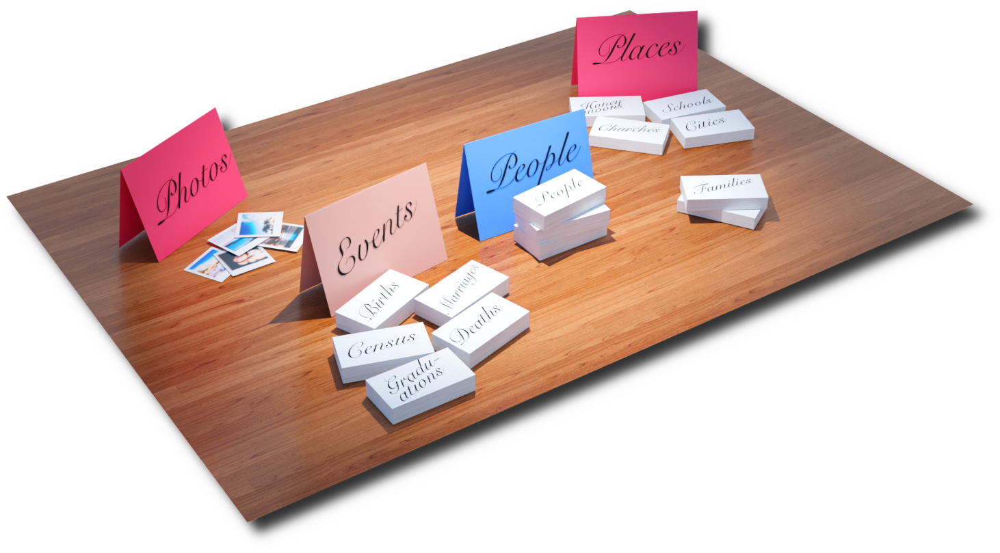

---

We believe Gramps Web is quite easy use; however, for users who may not be familiar with databases (db) and how they work, this section will discuss some basic database concepts and how Gramps organizes its data. If you are comfortable with the subject of databases, records, attributes and such, then feel free to skip over to the [<u>Gramps Record Types</u>](../record_types/record_types.md) section.

For our purposes, a database is simply software that can save a large amount of data in a way that it can be searched and displayed in useful ways, and in genealogy, saving, searching and displaying Family data is what its all about.

In the world of databases, the way the data is organized is called a ***data model***.  A filing cabinet with labeled folders is a data model.  The image below illustrates a possible data model for organizing genealogical topics (*click image to enlarge*).  Its simply a fancy way to say "*this is how we label and organize things*".  

## Records & Types

Databases consist of ***Record Types*** and ***Records*** A Record Type is a template of information that is related somehow. If you go to the Doctor and fill out a "*new patient form*", then the empty form represents a *Record Type*, and once you fill it out with your personal information, that form then becomes a *Record*.  The record type in this example might be called *"New Patient"*.  A single Record in Gramps/Gramps Web is very much like a single Index Card as illustrated above.

When we say ***Record Type***, just think of an "*empty form"* and when we say ***Record***, just think of a "*filled out form*".   A final note before continuing, the various fields that make up a Record Type we call ***Attributes*** or ***Properties*** of that Record, e.g. your first name is an attribute, your last name another, your email another, and your phone number yet another, etc.  

Gramps Web have 10 ***Primary*** Record Types, described in the next section.
