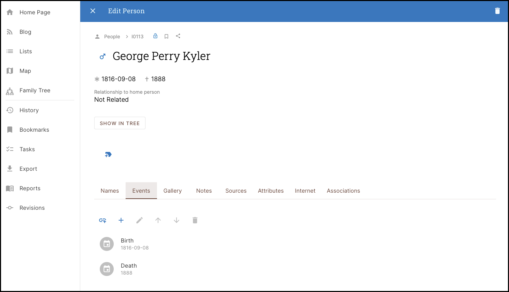

##	Names Tab

---

##	Events Tab

The Events Tab  is used to Add Events to a Record.  Events are typically added to ***Persons***,  ***Families***

##	Gallery Tab

---

##	Notes Tab

---

##	Sources Tab

---

##	Attributes Tab

---	

##	Internet Tab

---

##	Associations