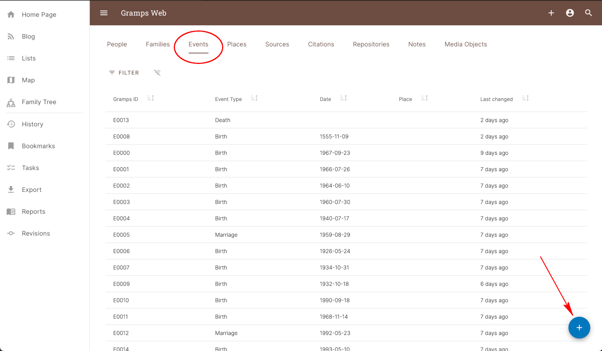

#	2 Ways to Add Records

---

There are two ways to add new Records to the Gramps Database.

*	General Additions
*	List View Additions

!!!WARNING
	*	When using the ***[+]*** button to add a new Record via the methods described below,  note that the Record is not actually added to the database initially.  Pressing the ***[+]*** button merely presents an [***Initial Add Form***](../fundamentals/fundamentals.md#initial-add-forms) for the Record so you may enter any initial information.  You must press the ***[ADD]*** button in the bottom right corner of the Initial Add Form in order to actually save the new Record to the Database. 
	*	If you Navigate away from an Initial Add Form to another page without pressing the [ADD] button, the Record will not be created/added to the database.

---

##	General Additions

General Record additions are made using the ***[+]*** button in the upper right corner of the Menu Bar.  Clicking this button will bring up a list of all available Record Types as shown below.  Select the type of Record that you want to create and Gramps Web will then display the [***Initial Add Form***](../fundamentals/fundamentals.md#initial-add-forms) for that Record Type so you can enter initial data.  

!!!NOTE
	To learn more about each Gramps Record type and the Initial Form Fields you will see for each, see the [Gramps Concepts > Record Types](../fundamentals/fundamentals.md#gramps-record-types) section of this User Guide.

{ width=200 } <i>Add Record List</i>

---

##	List View Additions

***List View Record Additions*** are made on the [***Lists***](../orientation/lists/lists.md) page using the Blue ***+*** button in the lower right corner as shown below.  The type of Record added depends on the List currently being viewed.  In the screenshot below, the ***Events*** list is active; therefore Adding a Record via the Blue ***+*** button will add a new ***Event Record*** and display the Initial Add Form for that Record Type. This method is typically used when adding lots of Records of the same type.

<!-- whitespace for navigation purposes -->

