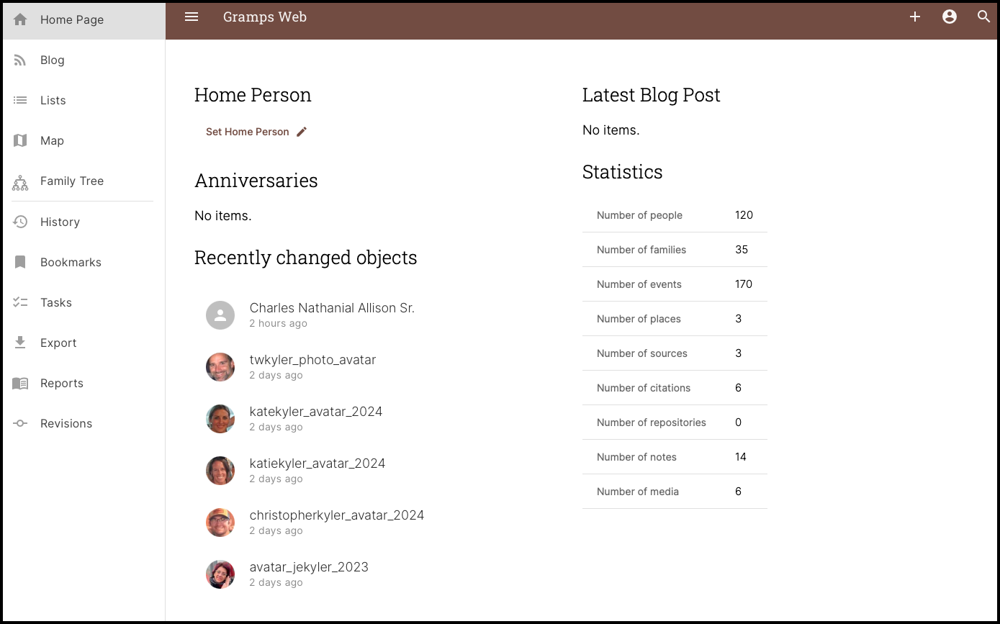
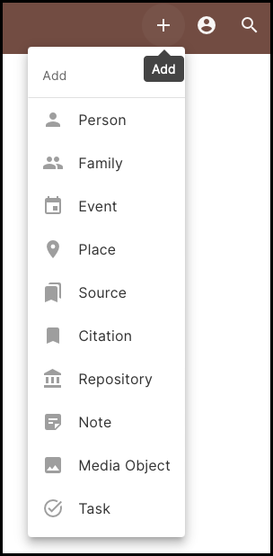

The Home Page is divided into 3 Primary Sections:

1.	The ***Navigation Panel*** along the left side.
2.	The ***Title Bar*** Across the Top
3.	The ***Main Window***

The *Navigation Panel* have 11 links to other Pages and is divided into an upper and lower section with a divider line between the two.  The upper links go to the more frequently used Pages during normal use of Gramps Web, and the lower links go to less frequently used Pages.

<i>Home Page Screen</i>

---

The *Title Bar* Across the Top have four icon buttons on it:

*	The ***Hamburger Button*** (3 horizontal lines) is used to show/hide the Left Side Navigation Panel.  It is helpful to close the Navigation Panel when viewing the Family Tree Graphs and you need more screenspace.

* 	The ***+*** (plus) button is used to ***Add a New Record*** as shown below.  There are 10 Record Types to choose from and each option represents a very specific ***Record Type*** in The Gramps Database. It is important to understand these Record Types and how they relate to one another in order to effectively use Gramps Web.  If you have not already read the section of this manual on Gramps' Record Types, then do so [here](../../../record-types/)

{ width=200 } <i>Add Record List</i>