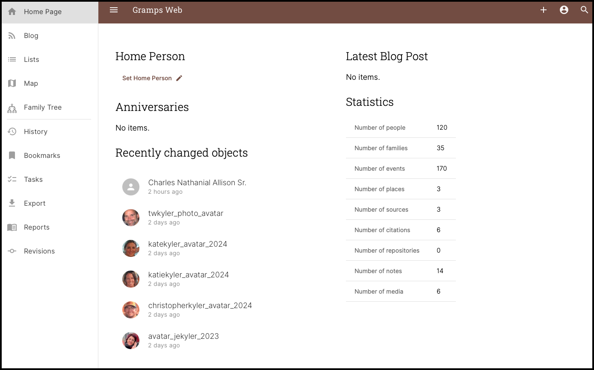
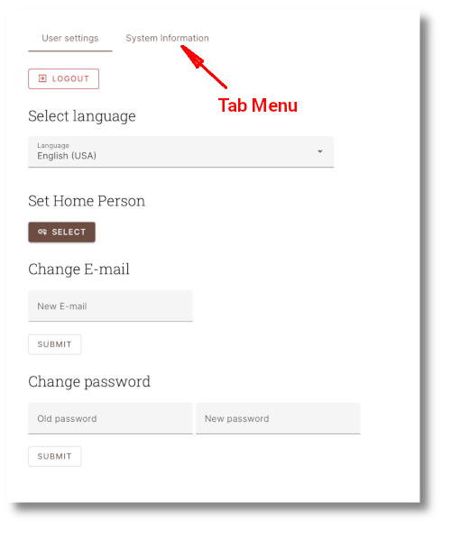
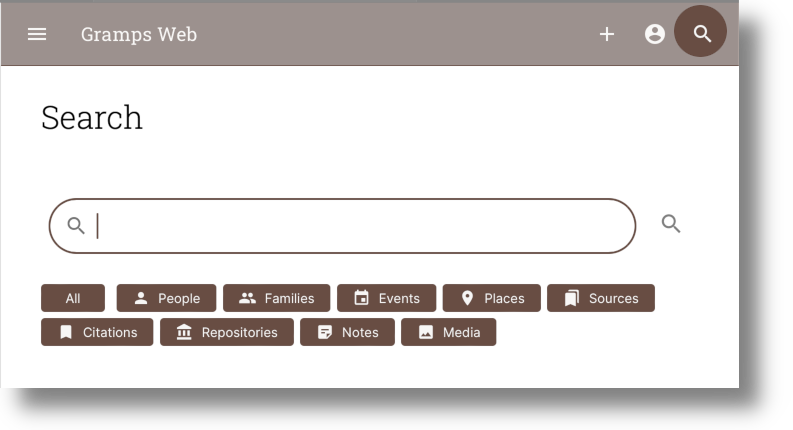
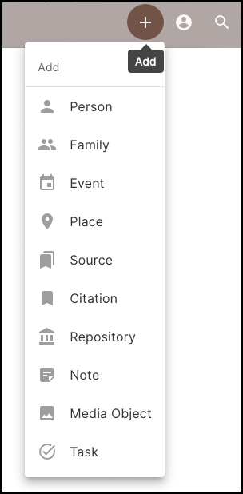

---

{width=300 align=right}

The Home Page is divided into 3 Primary Sections:

1.	The ***Title Bar*** Across the Top
2.	The ***Main Menu*** along the left side.
3.	The ***Main Content Window***

---

##	Title Bar

The *Title Bar* Across the Top have three or four icon buttons on it, depending on your User Level:

***1)*** The ***Hamburger Button*** (3 horizontal lines) ...

This button is available for all users and is used to show/hide the Left Side Navigation Panel.  This option is helpful when viewing the Family Tree Graphs and you want more screenspace.

***2)*** The ***User Preferences Button*** ...

This button is also available for all users.  This button will display a separate page (shown below) with a ***"tab menu"*** across the top.  The number of tabmenu items will vary depending upon your User level set by the Administrator.  

On this page, you can configure your User Settings and Logout of your session. Additional menu tabs for managing Users are available for administrators and higher level User accounts.  Also, it is on this page that you select the ***Home Person*** (<i>see [<u>Family Tree Views</u>](../../family_tree_view/introduction.md#home-person) for more information about the **Home Person**</i>), 

***3)*** The ***Search Button*** ...

{ width=500 }

The Search feature is available for all users and allows you to search all of Gramps Records.  This is one of the quickest ways to locate information.  Search results may be filtered by Record type by toggling the Record filters.  Search results are filtered dynamically as the filters are selected, so there is no need to select a Record filter before performing a search.

***4)*** The ***(ADD / +) button*** is only available for certain User accounts and is used to ***Add a New Record*** as shown below.  There are multiple Record Types to choose from. Selecting a Record will display an ***Initial Add Form*** for that Record type.  If you have not yet read the section of this guide regarding [<u>Gramps' Record Types</u>](../../db_concepts/record_types/record_types.md) and Initial Add Forms, then we recommend you do so.

{ width=200 }

---

##	Main Menu

  
   <i>Click to Enlarge</i>

The *Main Menu* have 11 links to other Pages and is divided into an upper and lower section with a divider line between the two.  The upper links go to the more frequently used Pages during normal use of Gramps Web, and the lower links go to less frequently used Pages.

---

##	Main Content Window

The contents of the Main Content window vary depending upon which page you are actively on. See the other Page Description sections of this manual for further information about each page contents.  For the ***Home Page*** Main Window shown in the image immediately above, the Main Content Window displays basic summary information.  

!!!Warning
	On the ***Home Page***, the ***Set Home Person*** link does not actually allow you to select the Home Person, but rather is a convenience link that takes you to your User Preferences page. It is on the ***User settings*** menu tab of the Prefs page that you actually select the ***Home Person***.

