---
hide:
  - toc
---

---

  
   <i>Click to Enlarge</i>

Gramps Web uses the same core software as Gramps Desktop and as such, can produce most of the same Reports.  The reports page presents you with a list of Reports available for export (See image at right). There are three primary report types.  ***Graphs***, ***Trees*** and ***Text Reports***.  

You select the report type you would like to generate, which brings up a subsequent page with several formatting options and parameters for the report.  Note that there may be quite a few options to configure the report.  [<u>See this Ancestor Tree Example</u>](example_config_screen.png).

Configure the options & parameters the way you want (or leave them all default) and hit the [***GENERATE***] button at the bottom of the page to generate the PDF report. You will be prompted to ***save*** the PDF file somewhere on your computer.

!!!Note
	Reports are only output to PDF for saving and are not displayed within the Gramps Web Application

<!-- 
This page only, we make all the report preview icons in the table 50px wide.  
We also draw a border around the icons. 
-->

---

##	Report Types

The table below shows all the reports available to select within Gramps Web.  You can click on the Preview Icon to enlarge it, and also click on the underlined names of the reports to go to the Gramps Documentation for more detailed information on each Report Type and its configuration options.

|Type|Name|Description|
|:--|:--|:--|
|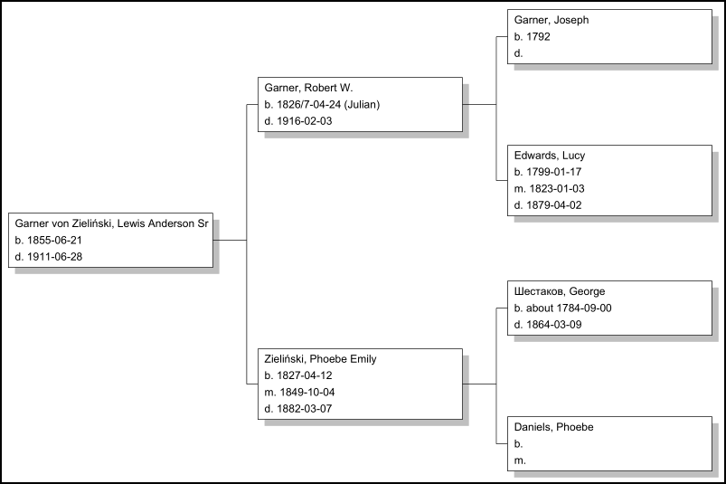|[<u>Ancestor Tree</u>](https://gramps-project.org/wiki/index.php/Gramps_5.2_Wiki_Manual_-_Reports_-_part_4#Ancestor_Tree) | A graphical ancestral tree|
|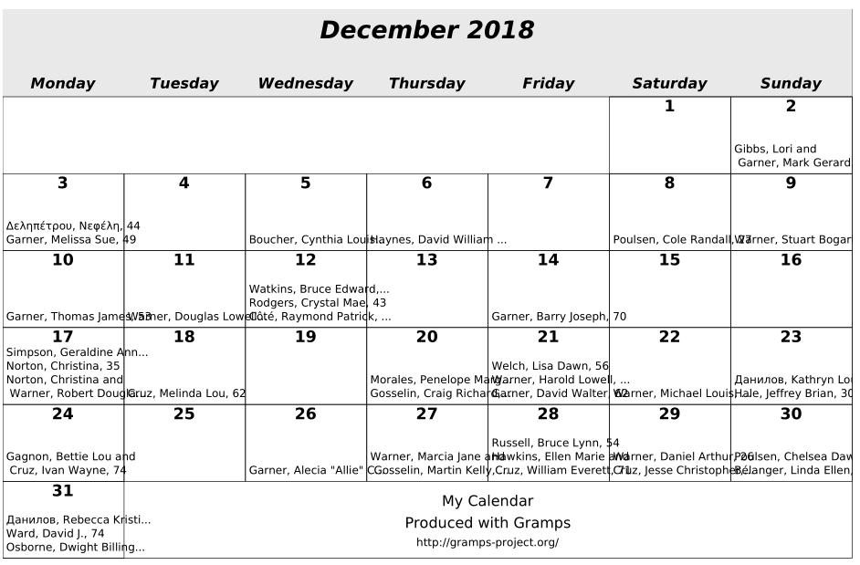| [<u>Calendar</u>](https://gramps-project.org/wiki/index.php/Gramps_5.2_Wiki_Manual_-_Reports_-_part_4#Calendar) | A graphical calendar|
|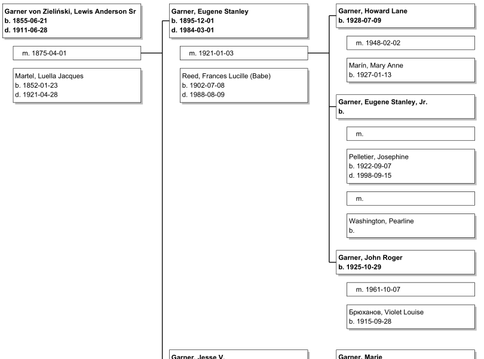| [<u>Descendant Tree</u>](https://gramps-project.org/wiki/index.php/Gramps_5.2_Wiki_Manual_-_Reports_-_part_4#Descendant_Tree) | A graphical descendant tree|
|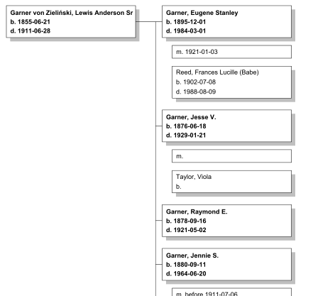| [<u>Family Descendant Tree</u>](https://gramps-project.org/wiki/index.php/Gramps_5.2_Wiki_Manual_-_Reports_-_part_4#Family_Descendant_Tree) | A graphical descendant tree around A family|
|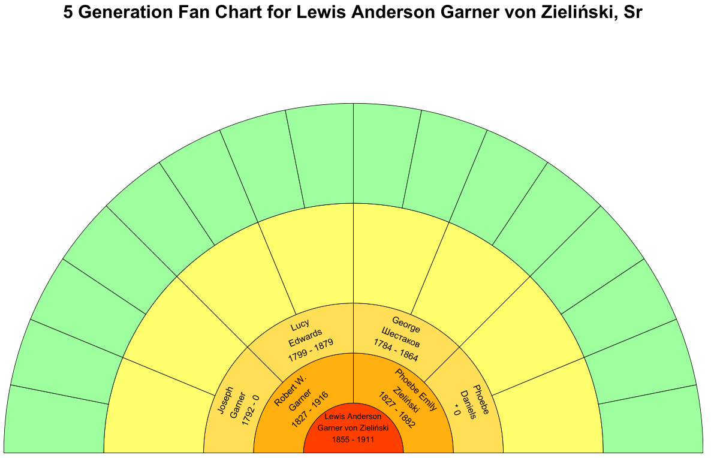| [<u>Fan Chart</u>](https://gramps-project.org/wiki/index.php/Gramps_5.2_Wiki_Manual_-_Reports_-_part_4#Fan_Chart) | Fan Charts|
|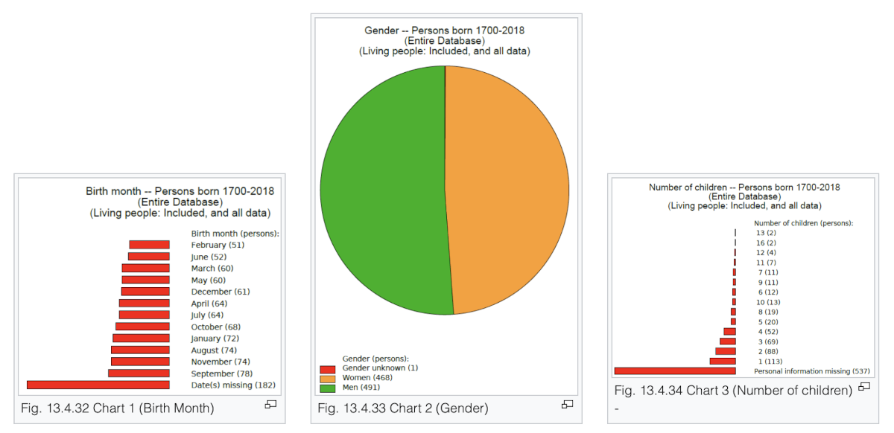| [<u>Statistics Charts</u>](https://gramps-project.org/wiki/index.php/Gramps_5.2_Wiki_Manual_-_Reports_-_part_4#Statistics_Charts) | Statistical bar and pie charts of the people in the database|
|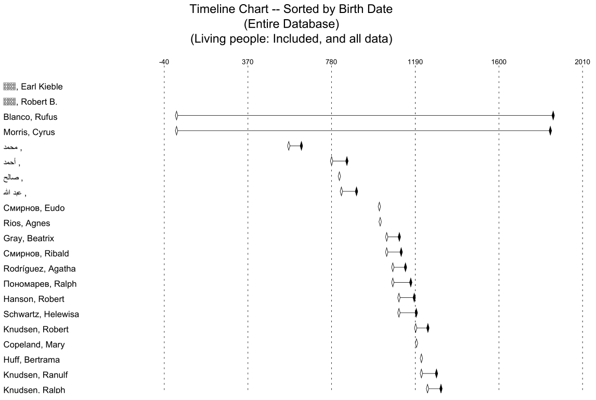| [<u>Timeline Chart</u>](https://gramps-project.org/wiki/index.php/Gramps_5.2_Wiki_Manual_-_Reports_-_part_4#Timeline_Chart) | A timeline chart.|
|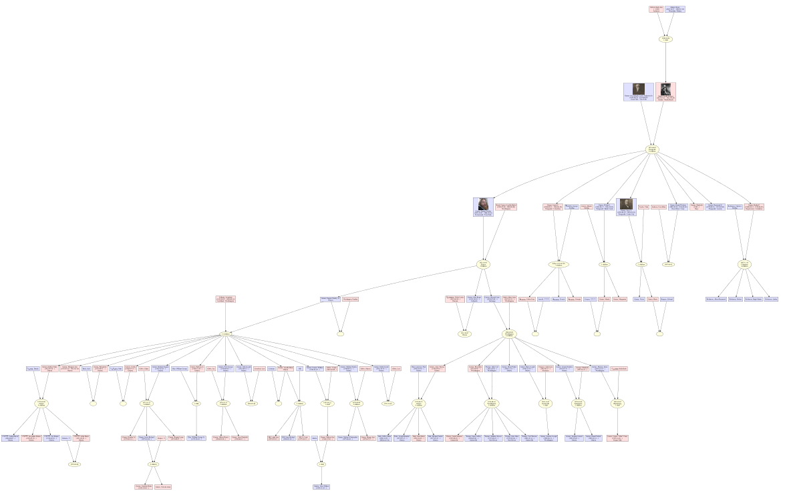| [<u>Family Lines Graph</u>](https://gramps-project.org/wiki/index.php/Gramps_5.2_Wiki_Manual_-_Reports_-_part_5#Family_Lines_Graph) | Family line graphs using Graphviz.|
|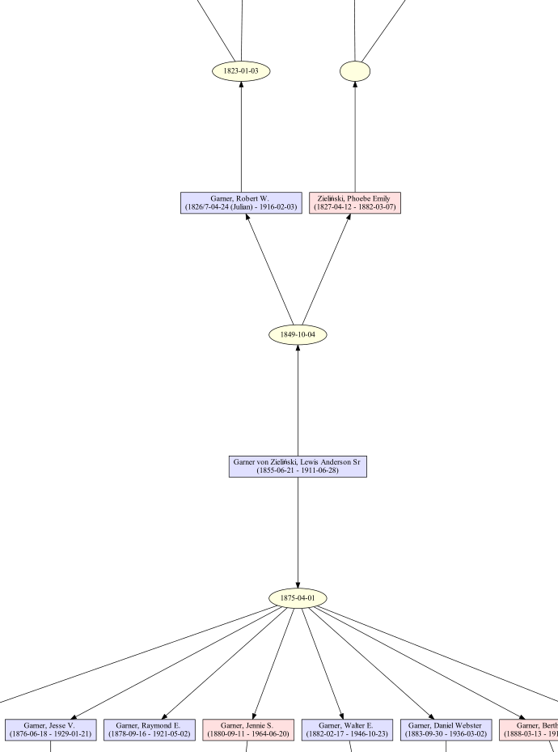| [<u>Hourglass Graph</u>](https://gramps-project.org/wiki/index.php/Gramps_5.2_Wiki_Manual_-_Reports_-_part_5#Hourglass_Graph) | An hourglass graph using Graphviz.|
|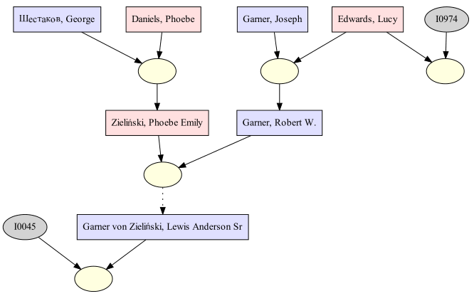| [<u>Relationship Graph</u>](https://gramps-project.org/wiki/index.php/Gramps_5.2_Wiki_Manual_-_Reports_-_part_5#Relationship_Graph) | relationship graphs using Graphviz.|
|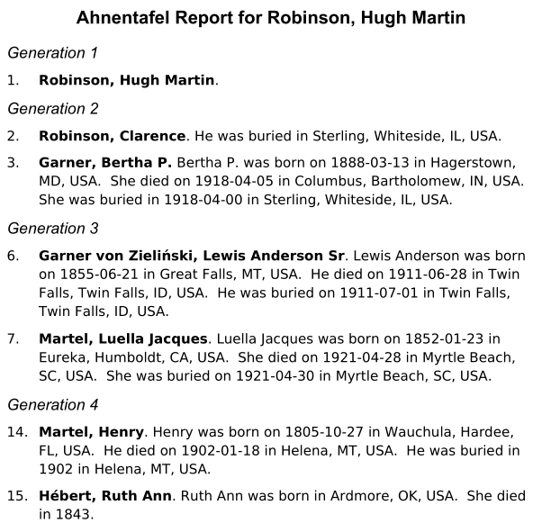| [<u>Ahnentafel Report</u>](https://gramps-project.org/wiki/index.php/Gramps_5.2_Wiki_Manual_-_Reports_-_part_6#Ahnentafel_Report) | A textual ancestral report|
|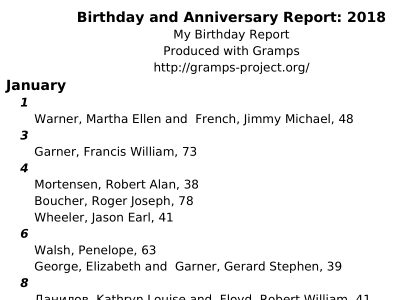| [<u>Birthday and Anniversary Report</u>](https://gramps-project.org/wiki/index.php/Gramps_5.2_Wiki_Manual_-_Reports_-_part_6#Birthday_and_Anniversary_Report) | A report of birthdays and anniversaries|
|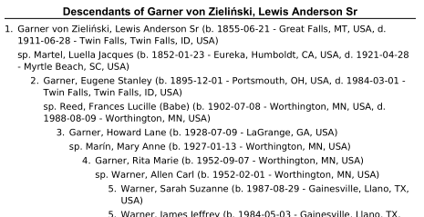| [<u>Descendant Report</u>](https://gramps-project.org/wiki/index.php/Gramps_5.2_Wiki_Manual_-_Reports_-_part_6#Descendant_Report) | A list of descendants of the active person|
|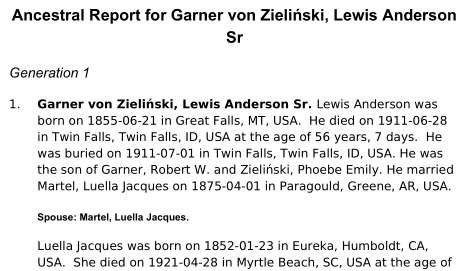| [<u>Detailed Ancestral Report</u>](https://gramps-project.org/wiki/index.php/Gramps_5.2_Wiki_Manual_-_Reports_-_part_6#Detailed_Ancestral_Report) | A detailed ancestral report|
|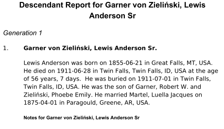| [<u>Detailed Descendant Report</u>](https://gramps-project.org/wiki/index.php/Gramps_5.2_Wiki_Manual_-_Reports_-_part_6#Detailed_Descendant_Report) | A detailed descendant report|
|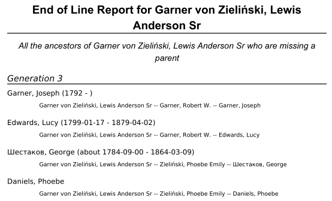| [<u>End of Line Report</u>](https://gramps-project.org/wiki/index.php/Gramps_5.2_Wiki_Manual_-_Reports_-_part_6#End_of_Line_Report) | A textual end of line report|
|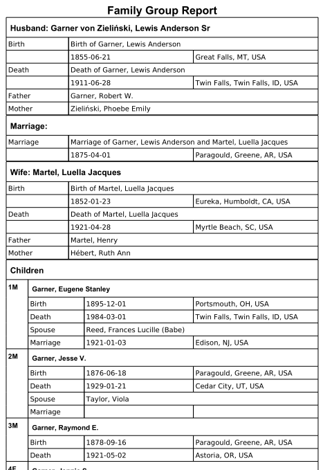| [<u>Family Group Report</u>](https://gramps-project.org/wiki/index.php/Gramps_5.2_Wiki_Manual_-_Reports_-_part_6#Family_Group_Report) | A family group report showing information on A set of parents and their children.|
|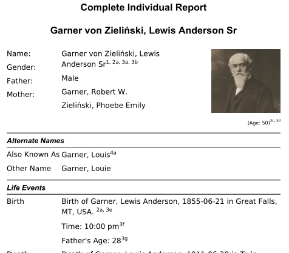| [<u>Complete Individual Report</u>](https://gramps-project.org/wiki/index.php/Gramps_5.2_Wiki_Manual_-_Reports_-_part_6#Complete_Individual_Report) | A complete report on the selected people|
|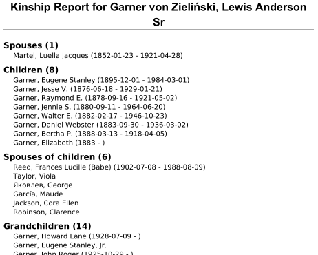| [<u>Kinship Report</u>](https://gramps-project.org/wiki/index.php/Gramps_5.2_Wiki_Manual_-_Reports_-_part_6#Kinship_Report) | A textual report of kinship for A given person|
|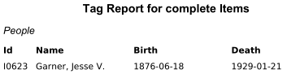| [<u>Tag Report</u>](https://gramps-project.org/wiki/index.php/Gramps_5.2_Wiki_Manual_-_Reports_-_part_6#Tag_Report) | A list of people with A specified tag|
|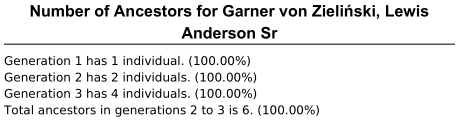| [<u>Number of Ancestors Report</u>](https://gramps-project.org/wiki/index.php/Gramps_5.2_Wiki_Manual_-_Reports_-_part_6#Number_of_Ancestors_Report) | number of ancestors of selected person|
|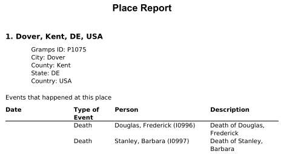| [<u>Place Report</u>](https://gramps-project.org/wiki/index.php/Gramps_5.2_Wiki_Manual_-_Reports_-_part_6#Place_Report) | A textual place report|
|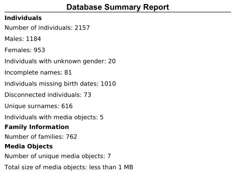| [<u>Database Summary Report</u>](https://gramps-project.org/wiki/index.php/Gramps_5.2_Wiki_Manual_-_Reports_-_part_6#Database_Summary_Report) | A summary of the current database|
|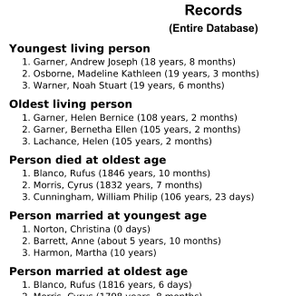| [<u>Records Report</u>](https://gramps-project.org/wiki/index.php/Gramps_5.2_Wiki_Manual_-_Reports_-_part_6#Records_Report) | Some interesting records about people and families|
|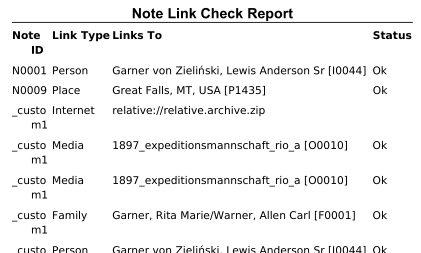| [<u>Note Link Report</u>](https://gramps-project.org/wiki/index.php/Gramps_5.2_Wiki_Manual_-_Reports_-_part_6#Note_Link_Report) | Shows status of links in notes|