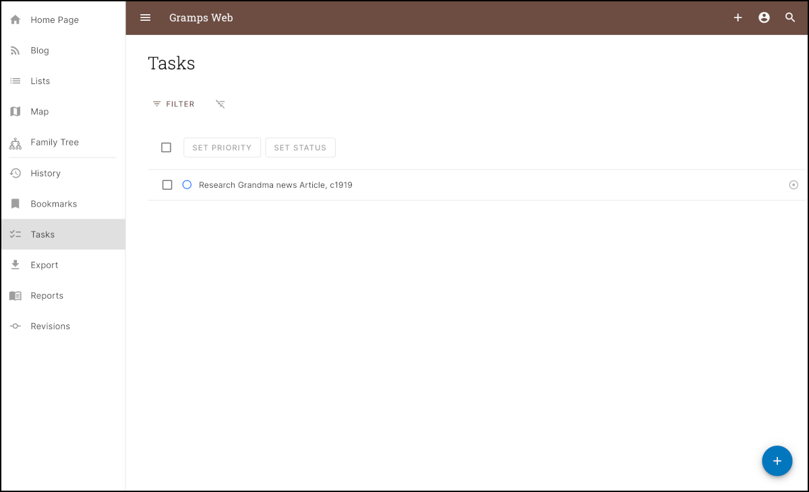

# Use the built-in task management

Gramps Web contains a built-in genealogical task management tool. It is meant to enable reserarches to plan and prioritize, but also document their tasks. This is why tasks are represented as sources in the Gramps database. After completing a task, the associated content can serve as a source documenting the research process.

## Task basics

Tasks have the following properties:

- Status. This can be "Open", "In Progress", "Blocked", or "Done"
- Priority. This can be "Low", "Medium", or "High"
- Tags. The labels are normal Gramps tags of the underlying source. (Note that all tasks additionally have the `ToDo` label to identify them as tasks, but this label is hidden in the task list to avoid clutter.)
- Title. Shown in the task list
- Description. A rich-text field that can be used to describe the problem statement, but also document any progress made
- Media. Any media files attached to the task

## Create a task

Since tasks are normal Gramps objects, they can be edited or created by the same group of users that can edit or create other objects (like people or events).

To create a task, click on the + button on the task list page. Enter at least a title. The status will always be "Open" on creation.

## Edit a task

To any of the task's details, click on it in the task list.

The task detail page does not have a separate "edit mode" like other Gramps objects. Changes to the title, status, and priority are applied immediately. Changes to the rich-text description require clicking the "save" button beneath it.

## Bulk change of task properties

The priority and status of tasks can be changed in bulk by using the checkboxes in the task list for selection and the appropriate buttons above the task list.

## Tasks in Gramps Desktop

When adding tasks via Gramps Web, both the sources and the notes will have the `ToDo` tag attached to them, so the tasks will show up in the desktop [To Do Notes Gramplet](https://gramps-project.org/wiki/index.php/Addon:ToDoNotesGramplet) as well as the [To Do Report](https://gramps-project.org/wiki/index.php/Addon:ToDoReport).

To add or edit a task in Gramps Desktop, use the following guidelines

- Add a source with tag `ToDo` and the task title as title
- Optionally, add a note to the source with tag `ToDo`, type "To Do", and the description as text
- Add an attribute "Status" and set it to "Open", "In Progress", "Blocked", or "Done"
- Add an attribute "Priority" and set it to 9 for low, 5 for medium, or 1 for high (these counter-intuitive values are taken from the iCalendar specification)
