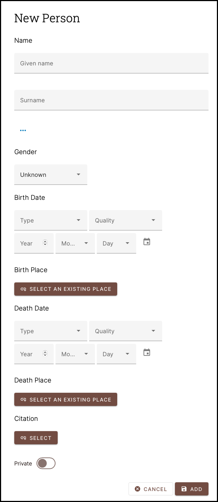
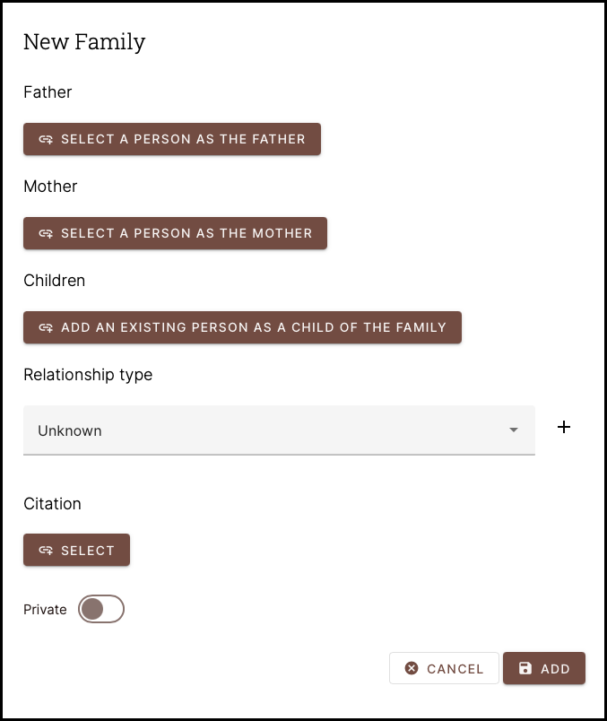
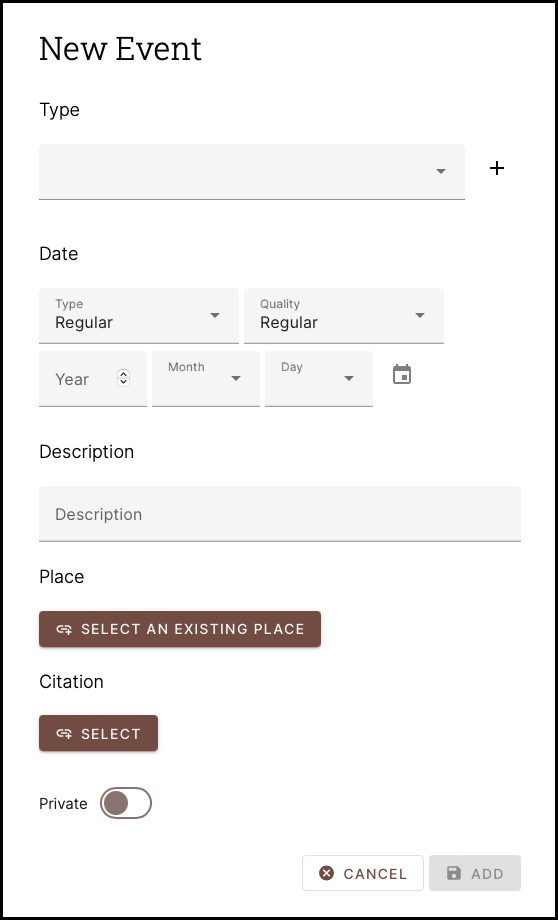
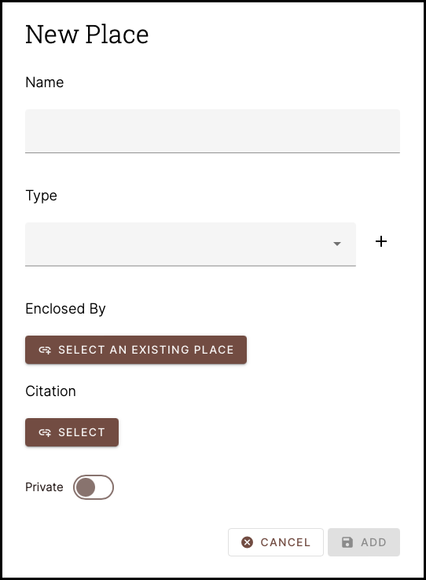
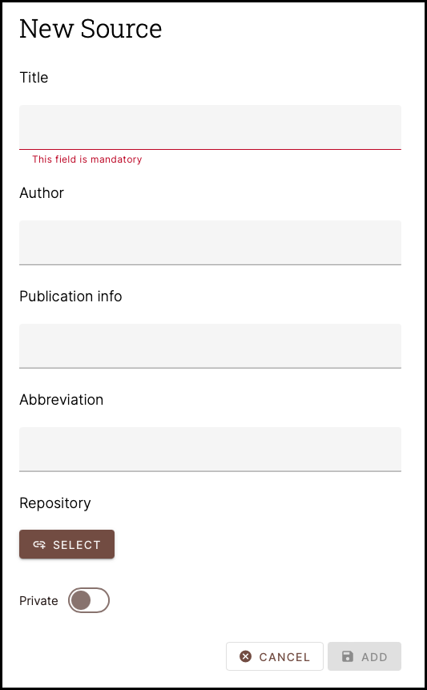
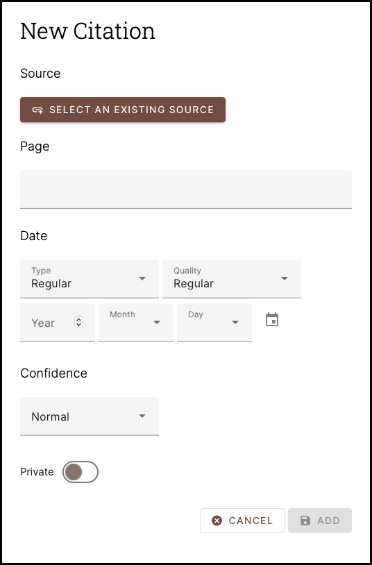
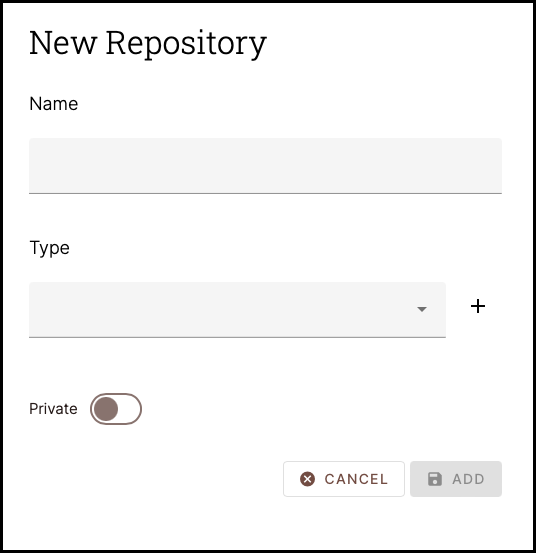
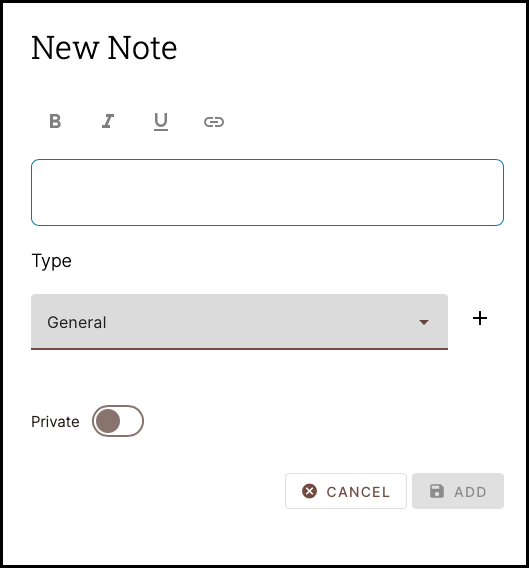
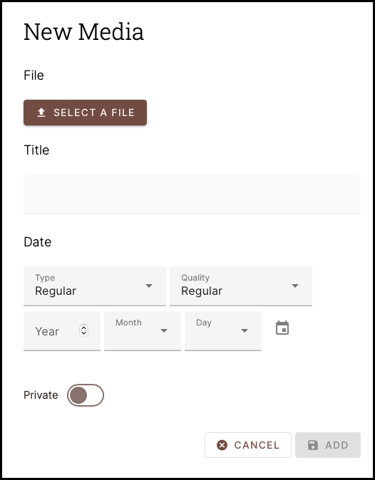
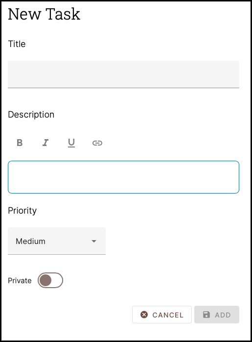

# Gramps Record Types

Gramps Web shares its **database** model with the [Gramps Desktop](https://gramps-project.org/blog/) application.  A database is a collection of individual ***Records*** and can have many differing record types. If you were tracking your genealogy in the days before computers, you might organize your records using Index cards as illustrated below.  (***click image to make it larger***)

A single database record in Gramps/Gramps Web is very much like a single Index Card.   The challenge is deciding what to label each card stack and then connecting all the cards in meaningful ways.  You may have a person connected to a photo, an event, a place and a family.  You may have a family connected to an event or photo etc. and the connections go on and on.  Fortunately, Gramps Web has has made it easy for you.

Gramps Web have 10 Record Types you should become familiar with. Each is independent and relies on no other for it to be created.  Each may be created at any time and in any order.  Once a Record is created, it may be edited at any time after as well, or even deleted. Each Record Type is Described below.

---

!!! Note
	The following screenshots below show the Gramps Web Interface that you will see when using the ***+ (Plus)*** button to add a new Record.  Editing an existing Record after they have been created is performed on a different web page with a differing appearance.  Editing existing Records is covered [elsewhere in this User Guide](../editing/persons/persons.md).

##	Person

{ align=left width=150 }

The Person Record is used to store basic information about a Person.  The only required fields are the ***Given Name*** and ***Surname***.  All other fields do not have to be filled in.  It is common to fill in all the fields you know and then go back and fill in others later using the ***Edit Person*** feature.  Most of the Record Fields are self-explanatory; however, a few of the fields may warrant further explanation.

*	***Given Name*** - This is the persons First and Middle Names.

*	***Surname*** - This is the persons Last Name, or Surname.  This should be the Birth Surname of the person.  For married persons who have taken the Surname of a spouse, you can add their Last Name later.  

*	

---

##	Family

{ align=left width=150 }

---

##	Event

{ align=left width=150 }

---

##	Place

{ align=left width=150 }

---

##	Source

{ align=left width=150 }

---

##	Citation

{ align=left width=150 }

---

##	Repository

{ align=left width=150 }

---

##	Note

{ align=left width=150 }

---

##	Media Object

{ align=left width=150 }

---	

##	Task

{ align=left width=150 }