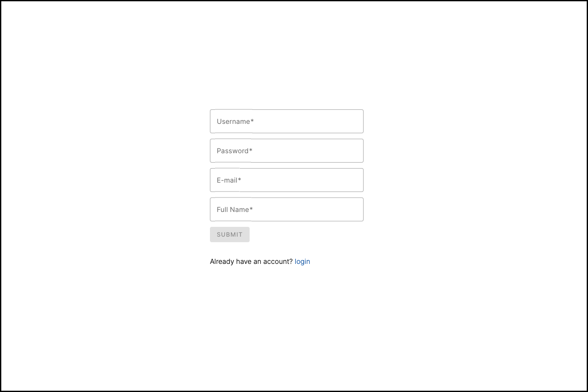

In a single-tree installation, anybody can register a new account at a Gramps Web instance, but it will need to be enabled manually by a site owner before it can be used to log in.

In a multi-tree installation, users additionally require the tree ID to sign up; in practice, this means they can sign up using a registration link shared by the tree owner.

## 1. Find registration form

On the login form on the home page of Gramps Web, usually there is a link "Register new account".

If this link is missing, it is probably because it is a multi-tree installation of Gramps Web. In that case, contact the tree owner for a registration link.

The tree owner can find and copy the registration link under Settings/Administration.

## 2. Submit registration form

The registration form has four mandatory fields: username, password, e-mail address, and full name. When all four fields have been filled, click "submit" to start the registration process.

## 3. Confirm e-mail address

After the form has been submitted, an automated e-mail will be sent to the e-mail address provided containing an e-mail confirmation link. Clicking it will open a confirmation page.

If the confirmation e-mail does not arrive (and you have checked your Spam folder), it could be that e-mail has not been configured correctly by the Gramps Web server administrator.

## 4. Enable account

After the e-mail address has been confirmed, the tree owner will receive an e-mail notification and can enable the new user account by going to the "User administration" section in settings page (accessible via the user icon in the top app bar) and changing the user role from "disabled" to any of the [other roles](../Users.md).

Note that the new user will *not* receive an automated notification that their account has been enabled, so it is advisible for the administrator to notify them personally.